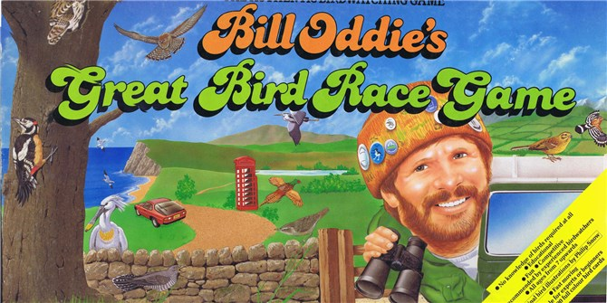

# birdrace
App for Bill Oddies Great Bird Race game

http://www.birdwatchingtrips.co.uk/bird-blog/blast-from-the-past-with-bill-oddie

TV screen grab on YouTube from one of the original designers: https://www.youtube.com/watch?v=3geoaZavYg0

The game uses a lot of cards and this app is meant to make the game quicker and easier to play.
It is not (yet) meant to replace playing the game in person. You still need a board.

The idea originated during the lockdown of Spring 2020. I wanted to play the board game with people remotely, so we used a web cam to project the board. This small app just allowed the game to flow a little more swiftly, as there was no need now to shuffle and manage the many decks of cards.

Here's a picture of v1 in use during the Spring of 2020. Webcam projecting the board to my mum and dad:

It doesn't show up on the photo particularly well, but that's a large cutout colour photo of my mum on the board - her playing piece!

## Version history

* v1 : Used Python, Guizero and SQLite
* v2 : Used Python, Guizero and MySQL (just for learning really)
* v3 : Used Python, Flash and HTML - for easier display on the web
* v4 : 2024 reboot - Tidied up the code A LOT (my 2020 code was terrible, but it worked). Switched back to SQLite3, because it's just makes more sense.

## To do list

- Add pictures of all the birds
- Add info for all the birds
- Tidy up layout - it is very rough
- Add a timer that you can set.
- Keep track of all cards drawn by specific players in the log
- Tweak frequency code - currently doesn't simulate the drawing of multiple cards and the changing probability of drawing another of the same type

## In the future list

- Replace phonebox cards with something more up to date.  (Rest breaks - mobile phones etc)
- Update bird list (e.g. there are no Egrets in preset game as they weren't as common 30 years ago!)

